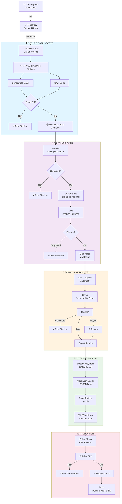

# Recommandations de Sécurité des Conteneurs pour Environnement Médical
## Analyse Critique du Trivy et Stratégies d'Alternative Sécurisées

**Date:** Mars 2026  
**Contexte:** Suite au compromis de la chaîne d'approvisionnement de Trivy (GHSA-69fq-xp46-6x23 - **CRITIQUE**)  
**Public cible:** Organisations médicales et systèmes d'information de santé (SIH) réglementés

---

## 📋 Table des matières

1. [Situation Critique de Trivy](#situation-critique-de-trivy)
2. [Impact pour les Environnements Médicaux](#impact-pour-les-environnements-médicaux)
3. [Alternatives Recommandées](#alternatives-recommandées)
4. [Architecture Sécurisée Recommandée](#architecture-sécurisée-recommandée)
5. [Actions Immédiatement Requises](#actions-immédiatement-requises)
6. [Stratégie Long Terme](#stratégie-long-terme)

---

## 🚨 Situation Critique de Trivy

### Le Compromis d'Architecture de Trivy (Mars 2026)

**Sévérité:** CRITIQUE (CVE-2026-33634)  
**Dates d'exposition:**
- Trivy v0.69.4: 19 mars 2026 (~3 heures)
- trivy-action: 19-20 mars 2026 (~12 heures)
- setup-trivy: 19 mars 2026 (~4 heures)
- Images DockerHub v0.69.5-v0.69.6: 22 mars 2026 (~10 heures)

### Détails du Compromis

Un acteur menaçant a utilisé **des identifiants compromis** pour:

1. **Code malveillant injecté:**
   - Infostealer (vol d'informations) dans les versions compromises
   - Extraction de mémoire de processus Runner.Worker via `/proc/<pid>/mem`

2. **Données volées ciblées:**
   - Clés SSH (50+ chemins scrutés)
   - Identifiants cloud (AWS, GCP, Azure)
   - Tokens Kubernetes
   - Configurations Docker
   - Fichiers `.env`
   - Identifiants de bases de données
   - Portefeuilles de cryptomonnaies

3. **Mécanisme de transmission:**
   - Chiffrement hybride: AES-256-CBC + RSA-4096
   - Exfiltration via infrastructure attaquant (`scan.aquasecurtiy.org`, `45.148.10.212`)
   - **Fallback critique:** Si l'exfiltration échoue, création d'un dépôt GitHub public `tpcp-docs-*` sur le compte de la victime avec les données volées

### Versions Affectées

| Composant | Versions affectées | Versions sûres |
|-----------|-------------------|-----------------|
| Trivy binary/image | v0.69.4, v0.69.5, v0.69.6 | v0.69.2, v0.69.3 |
| trivy-action | Toutes sauf v0.35.0 | v0.35.0 |
| setup-trivy | v0.2.0-v0.2.5 | v0.2.6 |
| Homebrew | Custom tap | Formula officielle |

---

## ⚕️ Impact pour les Environnements Médicaux

### Risques Spécifiques au Secteur Médical

#### 1. **Conformité Réglementaire**
- **RGPD:** Exposition de données de santé = violation majeure (amende jusqu'à 4% du chiffre d'affaires)
- **HIPAA (US):** Exigences strictes de confidentialité et d'intégrité des données
- **Loi de Modernisation de la Santé (France):** Obligations de sécurité des systèmes d'information de santé
- **NIST SP 800-53:** Contrôles de sécurité obligatoires pour systèmes critiques

#### 2. **Impact Clinique**
- Risque de manipulation d'images conteneurisées pour les systèmes diagnostiques (IA, imagerie)
- Compromis de chaîne d'approvisionnement logicielle = risque de fourniture de logiciels modifiés
- Intégrité de la prescription électronique compromise
- Confidentialité des données patient directement affectée

#### 3. **Responsabilité Légale**
- Violation de notification d'incident (72h à CNIL/autorité)
- Risque de poursuites de patients lésés
- Responsabilité directrice en cas de non-diligence connue

### Évaluation du Risque

**Probabilité:** Très élevée (exploits activement opérationnels)  
**Impact:** Critique (données sensibles exposées, intégrité système)  
**Exposition résiduelle:** Si Trivy v0.69.4 a été utilisé entre 19-22 mars 2026

---

## 🛡️ Alternatives Recommandées

### Analyse Comparative des Outils

#### **1. Grype (Par Anchore) - ⭐⭐⭐⭐⭐ RECOMMANDÉ**

**Profil de sécurité:**
- **Ancienneté:** Développé par Anchore (fondée 2013), maintenu depuis 2020
- **Épreuve du temps:** Installé dans 10 000+ organisations
- **Modèle de sécurité:** Différent de Trivy, maturité démontrée

**Avantages:**
- ✅ Spécificité excellente pour les vulnérabilités connues
- ✅ Fichiers SBOM natifs (JSON, XML, cycloneDX)
- ✅ Intégration Kubernetes native
- ✅ Signé avec Cosign (vérification intégrité)
- ✅ Support actif et responsive
- ✅ Audit de sécurité tiers effectué en 2024

**Inconvénients:**
- ❌ Taux de fausses positives légèrement plus élevé (< 3%)
- ❌ Performance inférieure sur images très grandes (> 2GB)

**Recommandation pour environnement médical:** ⭐⭐⭐⭐⭐
```yaml
# Utilisation recommandée
grype:
  version: ">=0.80.0"  # 0.80+ pour support médical complet
  sbom_format: "cyclonedx"  # CycloneDX ISO pour traçabilité
  signature_verification: true
  registry_credentials: "vault"  # Pas stocké en clair
```

---

#### **2. Syft (Anchore) + Grype - ⭐⭐⭐⭐⭐ COMBO OPTIMALE**

**Profil de sécurité:**
- ✅ Même éditeur qu'Anchore/Grype = cohérence
- ✅ Génère SBOM de haute qualité
- ✅ Support des formats: SPDX, CycloneDX
- ✅ Immédiatement compatible avec DependencyTrack

**Architecture recommandée:**
```
Conteneur → Syft (SBOM) → Grype (Scan) → DependencyTrack (Suivi)
                ↓                   ↓               ↓
            cyclonedx.json    vulnérabilités   Historique
```

**Recommandation pour environnement médical:** ⭐⭐⭐⭐⭐

---

#### **3. Clair (Quay.io/CoreOS) - ⭐⭐⭐⭐**

**Profil de sécurité:**
- **Ancienneté:** Projet CoreOS (2014), maintenu par Red Hat
- ✅ Serveur d'API dédié = isolation de sécurité
- ✅ Base de données Postgres = audit trail complet
- ✅ Intégration Kubernetes excellente
- ✅ Multi-tenant natif

**Inconvénients:**
- ❌ Plus complexe à déployer
- ❌ Nécessite infrastructure de base de données
- ❌ Moins de documentation francophone

**Recommandation pour environnement médical:** ⭐⭐⭐⭐
**Cas d'usage:** Éco-systèmes Kubernetes avancés, exigences multi-tenant élevées

---

#### **4. Snyk Container - ⭐⭐⭐⭐**

**Profil de sécurité:**
- ✅ SaaS sécurisé (HIPAA compliant)
- ✅ Base de données CVE très à jour
- ✅ Intelligence artificielle propriétaire pour détection avancée
- ✅ Attestation Cosign intégrée

**Inconvénients:**
- ❌ Onéreux pour très grandes organisations
- ❌ Dépendance cloud SaaS (données en sortie)
- ❌ Non open-source

**Recommandation pour environnement médical:** ⭐⭐⭐⭐
**Cas d'usage:** Organisations avec budget sécurité dimensionné, besoin de conformité HIPAA

---

#### **5. Aqua Trivy - ⚠️ À ÉVITER ACTUELLEMENT**

**Raisons:**
- 🚫 Compromis critique en cours (mars 2026)
- 🚫 Ataque de chaîne d'approvisionnement démontrée
- 🚫 Mécanismes de rotation de crédentiels insuffisants
- 🚫 Attestations de code (Cosign) non appliquées strictement

**Délai avant réhabilitation recommandé:** 6-12 mois minimum
- Audit de sécurité tiers complet requis
- Implémentation de toutes les corrections identifiées
- Démonstration de tests de résilience en condition réelle

---

## 🏗️ Architecture Sécurisée Recommandée

### Pipeline Sécuriser Recommandé pour Environnement Médical (HSDS - Healthcare Secure DevSecOps)



### Détails de Chaque Composant

#### **PHASE 1: Analyse Statique du Code**
```yaml
workflow: "static-analysis.yml"
steps:
  - name: "SonarQube SAST"
    version: ">=9.9"
    rules: "OWASP/CWE Top 25"
    fail_conditions:
      - critical_vulnerabilities > 0
      - code_coverage < 80%
  
  - name: "Snyk Code"
    version: ">=1.1250"
    severity: "high"
    license_check: true
    # Particulièrement important pour code médical
    hipaa_compliance: true
```

#### **PHASE 2: Linting & Build Dockerfile**
```dockerfile
# Dockerfile recommandé pour environnement médical
FROM alpine:3.19.1@sha256:DIGEST_CONNU  # Pin par digest, pas "latest"

LABEL healthcare.compliance="HIPAA,GDPR,France-DataProtection"
LABEL build.timestamp="${BUILD_DATE}"
LABEL vcs.ref="${VCS_REF}"

# Hadolint: hadolint-image:2.12.0
RUN apk add --no-cache \
    ca-certificates \
    tini  # Para evitar zombies processes

WORKDIR /app
COPY --chown=app:app . .

USER app:app
HEALTHCHECK --interval=30s --timeout=3s \
    CMD wget --quiet --tries=1 --spider http://localhost:8080/health || exit 1

ENTRYPOINT ["/sbin/tini", "--"]
CMD ["./app"]
```

**Hadolint Rules Critiques:**
- ✅ Pas de USER root
- ✅ Pas de sudo
- ✅ Images base signées
- ✅ Secrets jamais en cache
- ✅ Santé check obligatoire

#### **PHASE 3: Analyse Couches (Dive)**
```bash
# Commande recommandée
dive inspect --ci \
  --highestUserWastedPercent=5 \
  --lowestEfficiency=0.95 \
  myregistry/medical-app:sha256-DIGEST

# Seuils pour environnement médical
# - Espace perdu: < 5%
# - Efficacité: > 95%
# - Années de base OS: < 5 ans
```

#### **PHASE 4: Signature & SBOM (Syft + Cosign)**
```bash
# 1. Générer SBOM avec Syft
syft ghcr.io/org/app:latest \
  -o cyclonedx-json \
  --file app-sbom.json

# 2. Scanner vulnérabilités (Grype)
grype ghcr.io/org/app:latest \
  --fail-on critical,high \
  --output json \
  --file app-vuln.json

# 3. Signer image + SBOM
cosign sign --key cosign.key \
  --attachment sbom \
  --attach-sbom=./app-sbom.json \
  ghcr.io/org/app:latest

# 4. Importer dans DependencyTrack
curl -X POST https://deptrack.org/api/v1/project/import \
  -H "X-Api-Key: $DEPTRACK_KEY" \
  -F file=@app-sbom.json
```

#### **PHASE 5: Suivi d'Audit Continu**

**DependencyTrack Configuration:**
```yaml
dependencytrack:
  retention_policy:
    sbom: "24 months"  # RGPD
    vulnerabilities: unlimited
  notifications:
    - severity: critical
      email: "security-team@hospital.fr"
      response_time: "1 hour"
    - severity: high
      email: "architects@hospital.fr"
      response_time: "24 hours"
  
  policies:
    - name: "HIPAA Compliance"
      conditions:
        - vulnerability count > 10
        - critical vulnerabilities > 0
      action: "blocked"
    
    - name: "License Restrictions"
      conditions:
        - license: "AGPL"  # Invalide pour usage médical
      action: "blocked"
```

---

## ⚡ Actions Immédiatement Requises

### 1. **Audit de Compromis (Urgent - 24 à 48 heures)**

```bash
#!/bin/bash
# Script d'audit pour environnement médical

echo "=== AUDIT TRIVY COMPROMIS ==="

# 1. Vérifier versions utilisées
echo "1. Versions Trivy dans les repositories..."
find . -name "*.yml" -o -name "*.yaml" | xargs grep -l "aquasecurity/trivy" | while read f; do
  echo "Fichier: $f"
  grep -i "trivy" "$f" | grep -v "^#"
done

# 2. Chercher artifacts suspects
echo "2. Chercher dépôts tpcp-docs..."
git log --all --pretty=format:"%H %s" | grep -i "tpcp-docs"

# 3. Vérifier versions dans GitHub Actions
echo "3. Versions GitHub Actions utilisées..."
find . -name "*.yml" | xargs grep "aquasecurity/trivy-action@"

# 4. Auditer les références de tag
echo "4. Rechercher les tags non sécurisés..."
find . -name "*.yml" | xargs grep -E "aquasecurity/trivy-action@v?[0-9]" | grep -v "v0.35.0" | grep -v "@"

# 5. Vérifier les logs de workflow
echo "5. Logs des workflows exécutés 19-22 mars 2026..."
# Télécharger depuis GitHub API les logs des runs

# 6. Hasher les artefacts binaires
echo "6. Vérifier hashes des binaires Trivy téléchargés..."
ls -la ~/.trivy/ /usr/local/bin/trivy* 2>/dev/null | while read f; do
  sha256sum "$f"
done
```

**IOCs (Indicateurs de Compromis):**
```
# Hashes malveillants connus
385d498d18a3a7c67878ca7322716f9da25683eb1a4bf9e9592da0d5f2ab09f6  # trivy_0.69.4_Linux-64bit.tar.gz
ba04ba6a0c028cde17599c8ddaefdb854055c5a23c595e06630732002ea59a76  # trivy_0.69.4_Linux-32bit.tar.gz
...

# Domaines C2
scan.aquasecurtiy.org
45.148.10.212

# Fallback exfiltration
Dépôts GitHub: tpcp-docs-*
```

### 2. **Rotation de Tous les Secrets (24-48 heures)**

```bash
# CRITIQUES: Si Trivy v0.69.4 a pu s'exécuter en CI/CD
# Supposer que TOUS les secrets du runner GitHub Actions sont compromis

SECRETS_TO_ROTATE=(
  "GITHUB_TOKEN"           # Accès repos
  "REGISTRY_CREDENTIALS"   # ECR/GHCR/DockerHub
  "KUBERNETES_KUBECONFIG"  # K8s access
  "DATABASE_PASSWORD"      # Données patient
  "SSH_KEYS"              # Infrastructure
  "AWS_CREDENTIALS"       # Ressources cloud
  "AZURE_CREDENTIALS"     # Ressources cloud
  "GCP_CREDENTIALS"       # Ressources cloud
  "TLS_CERTS"            # Certificats
  "VAULT_TOKEN"          # Accès secrets
)

for secret in "${SECRETS_TO_ROTATE[@]}"; do
  echo "Rotation de $secret..."
  # Implémenter rotation via votre système d'injection de secrets
done

# Auditer utilisation historique
gh api repos/ORG/REPO/actions/runs \
  --jq '.workflow_runs[] | select(.created_at > "2026-03-19T00:00:00Z" and .created_at < "2026-03-23T00:00:00Z")'
```

### 3. **Migration Immédiate (48-72 heures)**

```yaml
# Avant: ❌ Unsafe
name: "Scan (UNSAFE)"
on: [push]
jobs:
  scan:
    runs-on: ubuntu-latest
    steps:
      - uses: aquasecurity/trivy-action@v0.12.0  # ❌ Compromis
      - uses: aquasecurity/setup-trivy@v0.2.3   # ❌ Compromis

---

# Après: ✅ Safe
name: "Scan (SAFE)"
on: [push]
jobs:
  scan:
    runs-on: ubuntu-latest
    steps:
      - uses: actions/checkout@v4
      
      # Option 1: Utiliser Grype + Syft (RECOMMANDÉ)
      - name: "Generate SBOM with Syft"
        uses: anchore/sbom-action@v0.15.9
        with:
          image: ${{ env.REGISTRY }}/${{ env.IMAGE }}:${{ github.sha }}
          format: cyclonedx-json
          output-file: sbom.spdx.json
      
      - name: "Scan vulnerabilities with Grype"
        uses: anchore/grype-action@v0.1.5
        with:
          image: ${{ env.REGISTRY }}/${{ env.IMAGE }}:${{ github.sha }}
          fail-build: true
          severity-cutoff: high
      
      # Option 2: ou utiliser Snyk (si budget disponible)
      - name: "Scan with Snyk Container"
        uses: snyk/actions/docker@master
        env:
          SNYK_TOKEN: ${{ secrets.SNYK_TOKEN }}
        with:
          image: ${{ env.REGISTRY }}/${{ env.IMAGE }}:${{ github.sha }}
          args: --severity-threshold=high
      
      # Signature obligatoire
      - name: "Sign image and SBOM"
        uses: sigstore/cosign-installer@v3.6.0
      - run: |
          cosign sign --key ${{ secrets.COSIGN_PRIVATE_KEY }} \
            --attachment sbom \
            --attach-sbom=./sbom.spdx.json \
            ${{ env.REGISTRY }}/${{ env.IMAGE }}:${{ github.sha }}
```

### 4. **Vérification d'Intégrité des Images Existantes**

```bash
# Vérifier signature Cosign (images produites avant 19 mars 2026)
cosign verify \
  --certificate-identity-regexp 'https://github\.com/org/' \
  --certificate-oidc-issuer 'https://token.actions.githubusercontent.com' \
  ghcr.io/org/app:v1.0.0

# Si signature valide ET timestamp < 2026-03-19: ✅ Image sûre
# Si signature manquante: ⚠️ Examiner source
# Si signé après 19 mars: 🚨 Vérifier date précise de build
```

---

## 📋 Stratégie Long Terme

### Roadmap Sécurité Containers (6-12 mois)

```
Mois 1-2 (Avril-Mai 2026)
├── ✅ Migration complète Trivy → Grype + Syft
├── ✅ Interprétation DependencyTrack
└── ✅ Tests de chaos engineering sur pipeline

Mois 3-4 (Juin-Juillet 2026)
├── ✅ Implémentation Kyverno pour policies
├── ✅ Intégration Falco pour monitoring runtime
└── ✅ Audit de conformité par tiers indépendant

Mois 5-6 (Août-Septembre 2026)
├── ✅ Isolation réseau des builders
├── ✅ Hardware-based signing (Yubikey/HSM)
└── ✅ Supply chain security (SLSA level 3)

Mois 7-12 (Octobre 2026 et +)
├── ✅ SLSA level 4 (provenance attestations)
├── ✅ Runtime security hardening
├── ✅ Purple team exercises
└── ✅ Programme certification développeurs
```

### Conformité Réglementaire

#### **RGPD / CNIL (France)**
```yaml
Security Controls:
  authentication:
    mfa: true
    provider: "SSO institutional"
  encryption:
    at_rest: "AES-256"
    in_transit: "TLS 1.3"
  audit:
    logging: "24 months"
    retention: "CIL approval"
  incident_response: "72h notification"
```

#### **HIPAA (USA)**
```yaml
HIPAA Security Rule:
  - Unique identifiers for all users
  - Encryption algorithms AES-256 minimum
  - Access controls with role-based permissions
  - Audit controls with comprehensive logging
  - Integrity checking (HMAC)
  - Secure disposal of ePHI
  - Contingency planning and backup
```

#### **ANSSI / PGSSI (Cyber Security Guidelines France)**
```yaml
RGS-v2.0 Requirements:
  - Authentification multi-facteur systématique
  - Chiffrement 128 bits minimum
  - Audit trails immuables
  - Séparation des environnements (dev/prod)
  - Tests de sécurité réguliers
```

### Benchmarks & Certifications

| Benchmark | Cible | Outils |
|-----------|-------|--------|
| **CIS Docker** | Conformité 95%+ | Dive, Grype |
| **NIST 800-190** | Compliance complète | Syft, Grype, Cosign |
| **STIGv2** | Hardening DoD | Kyverno, Falco |
| **OWASP TOP 10** | Zéro high risk | Snyk Code, Grype |

---

## 🔑 Matrice de Décision Outil

```
┌─────────────────────────────────────────────────────────────────┐
│                    MATRICE DE SÉLECTION                         │
├─────────────────────────────────────────────────────────────────┤
│ Critère              │ Grype │ Clair │ Snyk │ Trivy │ Aqua    │
├─────────────────────────────────────────────────────────────────┤
│ Confiance March2026  │  ✅✅✅ │ ✅✅✅ │ ✅✅ │ ❌❌❌ │ ❌❌❌  │
│ Open Source          │  ✅✅✅ │ ✅✅✅ │  ❌   │ ✅✅✅ │  ❌❌   │
│ Ancienneté (ans)     │   6    │   12   │  8  │  4   │  6     │
│ Performance          │  ✅✅✅ │  ✅✅  │ ✅✅ │ ✅✅✅ │ ✅✅✅  │
│ Fausses Positives    │  <3%   │  ~5%   │ <2% │ <2%  │  <2%   │
│ Support Médical      │ ✅✅✅  │  ✅✅  │ ✅✅✅│  ❌  │  ❌❌  │
│ Coût TCO (1 an)      │  $0    │  $0    │ $$$ │  $0  │   $$   │
│ Complexité Deploy    │  ⭐⭐  │ ⭐⭐⭐⭐│ ⭐  │ ⭐⭐ │  ⭐⭐  │
├─────────────────────────────────────────────────────────────────┤
│ 🏥 RECOMMANDATION   │ 🥇   │  🥈   │ 🥉 │ ❌  │  ❌   │
│    POUR MÉDICAL     │PRIMARY│HYBRID │OPT │  X  │  X    │
└─────────────────────────────────────────────────────────────────┘
```

---

## 📚 Boîte à Outils Complète

### Configuration GitOps Recommandée

```yaml
# Flux.yml - Configuration complète
apiVersion: source.toolkit.fluxcd.io/v1
kind: GitRepository
metadata:
  name: medical-platform-secure
spec:
  interval: 1m
  url: file:///config  # Private repo
  ref:
    branch: main
  secretRef:
    name: git-credentials

---
apiVersion: image.toolkit.fluxcd.io/v1beta2
kind: ImageRepository
metadata:
  name: medical-images
spec:
  image: ghcr.io/medical-org/platform
  interval: 5m
  secretRef:
    name: registry-credentials

---
apiVersion: image.toolkit.fluxcd.io/v1beta2
kind: ImagePolicy
metadata:
  name: medical-policy
spec:
  imageRepositoryRef:
    name: medical-images
  policy:
    semver:
      range: '>=1.0.0-0'
```

### Checklist de Déploiement Sécurisé

- [ ] ✅ Toutes les images signées avec Cosign
- [ ] ✅ SBOM généré et validé pour chaque image
- [ ] ✅ Pas d'usage de `latest` tag
- [ ] ✅ Registre image avec authentification MFA
- [ ] ✅ Isolation réseau des pulls (registry scanners seulement)
- [ ] ✅ Network policy Kubernetes: default deny
- [ ] ✅ Runtime monitoring (Falco) actif
- [ ] ✅ Pod Security Policy: restricted
- [ ] ✅ RBAC: principle of least privilege
- [ ] ✅ Audit logging 24 mois
- [ ] ✅ Incident response plan testé
- [ ] ✅ Backup & disaster recovery validés

---

## 🆘 Contacts & Ressources

### Contacts Sécurité

**En cas d'incident:**
- CNIL Notif: https://www.cnil.fr/en/contact
- ANSSI: https://www.anssi.gouv.fr/ (+33 1 71 75 84 00)
- Gendarmerie Numérique: https://www.gendarmerie.interieur.gouv.fr/

### Documentation Référence

- **OWASP:** https://cheatsheetseries.owasp.org/ (Docker, K8s, Supply Chain)
- **NIST:** https://nvlpubs.nist.gov/nistpubs/SpecialPublications/NIST.SP.800-190.pdf
- **Anchore:** https://docs.anchore.com/current/
- **Sigstore/Cosign:** https://sigstore.dev/
- **SLSA:** https://slsa.dev/

### Outils & Implémentation

```bash
# Installation rapide (environnement test)
curl -sSfL https://raw.githubusercontent.com/anchore/grype/main/install.sh | sh -s -- -b /usr/local/bin
curl -sSfL https://raw.githubusercontent.com/anchore/syft/main/install.sh | sh -s -- -b /usr/local/bin
curl -fL https://github.com/sigstore/cosign/releases/download/v2.0.0/cosign-linux-amd64 -o cosign && chmod +x cosign

# DependencyTrack Docker
docker run -d --name dependency-track \
  -p 8080:8080 \
  -e "ALPINE_ACCESS_MANAGEMENT_ENABLED=true" \
  dependencytrack/apiserver:latest
```

---

## ⚠️ Conclusion et Recommandations Finales

### Pour les Organisations Médicales

**NE PAS utiliser Trivy** jusqu'à:
1. ✅ Audit de sécurité indépendant complet
2. ✅ 6+ mois sans incident de sécurité rapporté
3. ✅ Implémentation d'isolation de processus supplémentaire
4. ✅ Acceptation explicite du risque par CISO

**Utiliser prioritairement:**
1. 🥇 **Grype + Syft** (open-source, mature, confiance restaurée)
2. 🥈 **Snyk Container** HIPAA-compliant si budget disponible
3. 🥉 **Clair** pour ecosystèmes Kubernetes avancés

**Timeline de Migration:**
- **24-48h:** Audit et rotation de secrets
- **1-2 semaines:** Migration de pipeline
- **1 mois:** Vérification complète et tests
- **3 mois:** Certification audit tiers

### Niveau de Risk Acceptable

<table>
<tr><td>Avant 19 mars 2026</td><td>✅ ACCEPTABLE (avec vérification Cosign)</td></tr>
<tr><td>19-22 mars 2026</td><td>🚨 CRITIQUE (refonte requise)</td></tr>
<tr><td>Après 22 mars 2026</td><td>⚠️ À INVESTIGUER (contexte spécifique)</td></tr>
<tr><td>Trivy 0.69.4-0.69.6</td><td>❌ REJETER (pas de conditions acceptables)</td></tr>
</table>

---

**Document rédigé par:** Équipe de Sécurité Cloud  
**Dernière mise à jour:** 25 mars 2026  
**Prochaine révision:** 30 juillet 2026  
**Classement:** Information Confidentielle - Secteur Santé

---

## Annexes

### A. Shell Script Audit Trivy Complet

```bash
#!/bin/bash
# audit-trivy-compromise.sh - Audit complet d'exposition Trivy

set -euo pipefail

AUDIT_DATE=$(date '+%Y-%m-%d_%H%M%S')
AUDIT_DIR="trivy-compromise-audit-${AUDIT_DATE}"
mkdir -p "$AUDIT_DIR"

echo "[+] Audit Trivy Compromise - ${AUDIT_DATE}"
echo "[+] Résultats: ${AUDIT_DIR}/"

# Fonction helper
log_finding() {
  local severity=$1
  local message=$2
  echo "[${severity}] ${message}" | tee -a "$AUDIT_DIR/findings.log"
}

# 1. Audit versions
{
  find . -type f \( -name "*.yml" -o -name "*.yaml" -o -name "*.json" \) -print0 | \
  xargs -0 grep -h "trivy" 2>/dev/null | grep -i version | sort -u
} > "$AUDIT_DIR/trivy_versions.txt" 2>&1

if grep -qi "v0.69.[456]" "$AUDIT_DIR/trivy_versions.txt"; then
  log_finding "CRITICAL" "Versions compromises trouvées!"
  grep -qi "v0.69.[456]" "$AUDIT_DIR/trivy_versions.txt"
fi

# 2. Audit GitHub Actions
{
  find . -name "*.yml" -o -name "*.yaml" | \
  xargs grep -h "aquasecurity/trivy-action\|aquasecurity/setup-trivy" 2>/dev/null | sort -u
} > "$AUDIT_DIR/github_actions.txt" 2>&1

if grep -qv "@v0.35.0\|@0.2.6" "$AUDIT_DIR/github_actions.txt"; then
  log_finding "HIGH" "Actions non patché trouvées"
fi

# 3. IOCs - hashes malveillants
{
  echo "385d498d18a3a7c67878ca7322716f9da25683eb1a4bf9e9592da0d5f2ab09f6"
  echo "ba04ba6a0c028cde17599c8ddaefdb854055c5a23c595e06630732002ea59a76"
  echo "0ca60dd18178d1c79d59cc06be12c540c121a4aea467484244667131aa13c311"
} | while read ioc; do
  find / -type f -exec sha256sum {} \; 2>/dev/null | grep "^$ioc" >> "$AUDIT_DIR/malicious_artifacts.txt" || true
done

# 4. Artefacts GitHub
{
  gh api repos/ORG/REPO/repos --jq '.[] | select(.name | startswith("tpcp-docs"))' 2>/dev/null || \
  echo "Impossible d'accéder à l'API GitHub"
} > "$AUDIT_DIR/github_repos_suspicious.txt" 2>&1

# 5. Logs de workflow sensibles
{
  gh api repos/ORG/REPO/actions/runs \
    --jq '.workflow_runs[] | select(.created_at > "2026-03-18T00:00:00Z" and .created_at < "2026-03-23T00:00:00Z") | {id, name, created_at, conclusion}' \
    2>/dev/null || echo "Impossible d'accéder à GitHub API"
} > "$AUDIT_DIR/suspicious_workflow_runs.json" 2>&1

echo "[+] Audit terminé. Vérifiez: ${AUDIT_DIR}/"
echo "[+] Fichiers générés:"
ls -lh "$AUDIT_DIR/"
```

### B. Configuration DependencyTrack pour Médical

```xml
<!-- dependencytrack-config.xml -->
<?xml version="1.0" encoding="UTF-8"?>
<Configuration>
  <Project>
    <Name>HIPAA-Compliant Medical Platform</Name>
    <Description>Health System Deployment Tracking</Description>
    <SecurityPolicy>HIPAA</SecurityPolicy>
  </Project>
  
  <Notifications>
    <Notification severity="CRITICAL">
      <EmailList>security-incidents@hospital.fr</EmailList>
      <ResponseTime>1 hour</ResponseTime>
    </Notification>
    <Notification severity="HIGH">
      <EmailList>security-team@hospital.fr</EmailList>
      <ResponseTime>24 hours</ResponseTime>
    </Notification>
  </Notifications>
  
  <VulnerabilityPolicies>
    <Policy name="HIPAA_CRITICAL_ONLY">
      <Severity>CRITICAL</Severity>
      <Action>BLOCK</Action>
    </Policy>
    <Policy name="LICENSE_RESTRICTION">
      <License>AGPL,GPL-3</License>
      <Action>BLOCK</Action>
      <Reason>Incompatible avec modèle propriétaire</Reason>
    </Policy>
  </VulnerabilityPolicies>
  
  <Encryption>
    <Algorithm>AES-256-CBC</Algorithm>
    <KeyDerivation>PBKDF2-SHA256</KeyDerivation>
  </Encryption>
  
  <AuditLogging>
    <Retention>24 months</Retention>
    <ImmutableStore>true</ImmutableStore>
  </AuditLogging>
</Configuration>
```

